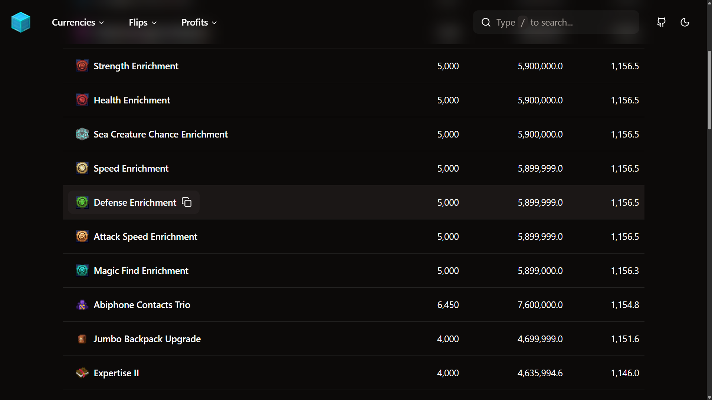
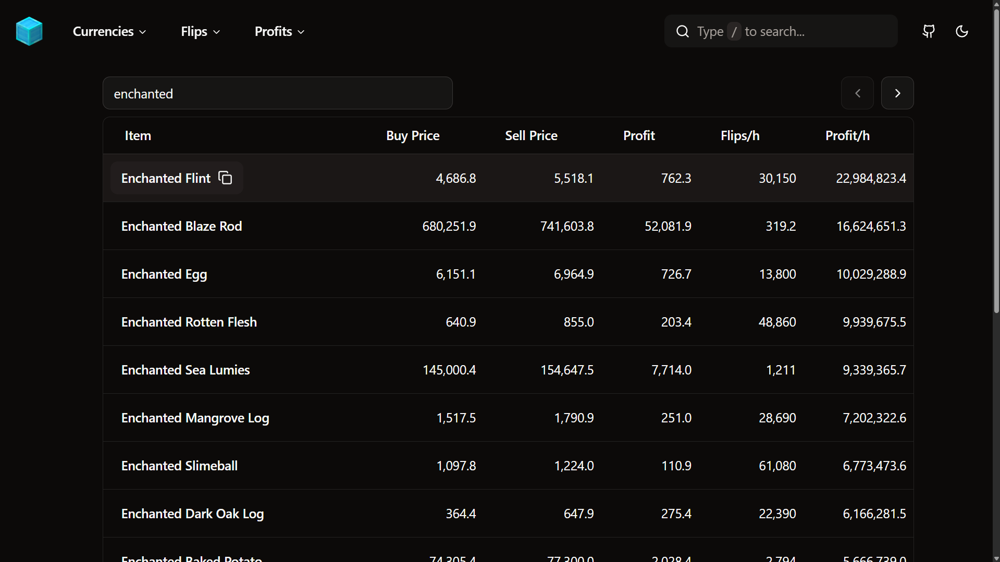

<a id="top"></a>

<div align="center">
  <a href="https://github.com/natebabyak/skyrocket">
    
  </a>
  <h3>Skyrocket</h3>
</div>

<details>
  <summary>Table of Contents</summary>
  <ol>
    <li>
      <a href="#about">About</a>
      <ul>
        <li><a href="#built-with">Built With</a></li>
      </ul>
    </li>
    <li>
      <a href="#getting-started">Getting Started</a>
      <ul>
        <li><a href="#prerequisites">Prerequisites</a></li>
        <li><a href="#installation">Installation</a></li>
      </ul>
    </li>
    <li>
      <a href="#usage">Usage</a>
      <ul>
        <li><a href="#bits">Bits</a></li>
        <li><a href="#bazaar">Bazaar</a></li>
      </ul>
    </li>
    <li><a href="#license">License</a></li>
    <li><a href="#contact">Contact</a></li>
    <li><a href="#acknowledgments">Acknowledgments</a></li>
  </ol>
</details>

<!-- ABOUT -->

## About

Skyrocket is a free and open-source web app that provides real-time market insights for Hypixel SkyBlock, built as a modern successor to [SkyFlip](https://github.com/natebabyak/skyflip).

While other similar tools exist, many are hindered by clunky interfaces or poor performance—issues Skyrocket was designed to address with a clean UI and fast, responsive experience.

The project includes two fully functional pages (see [Usage](#usage)) and serves as a solid reference or starting point for developers building similar tools (see [Installation](#installation)). Although development is complete, the codebase remains available for learning, forking, or extending.

<p align="right"><a href="#top">Back to Top</a></p>

<!-- BUILT WITH -->

### Built With

- [](https://svelte.dev/)
- [](https://svelte.dev/)
- [](https://www.typescriptlang.org/)
- [](https://vite.dev/)
- [](https://tailwindcss.com/)
- [](https://www.shadcn-svelte.com/)

<p align="right"><a href="#top">Back to Top</a></p>

<!-- GETTING STARTED -->

## Getting Started

<!-- PREREQUISITES -->

### Prerequisites

- npm

  ```bash
  npm install npm@latest -g
  ```

<!-- INSTALLATION -->

### Installation

1. Clone the repository

   ```bash
   git clone https://github.com/natebabyak/skyrocket.git
   ```

2. Install the dependencies

   ```bash
   npm install
   ```

3. Start the local development server

   ```bash
   npm run dev
   ```

<p align="right"><a href="#top">Back to Top</a></p>

## Usage

### Bits (`/currencies/bits`)

Displays optimal Bits usage based on profitability after tax.

<figure align="center">
  
  <figcaption>Screenshot of Bits (<code>/currencies/bits</code>)</figcaption>
</figure>

<div align="right"><a href="#top">Back to Top</a></div>

### Bazaar (`/flips/bazaar`)

Displays top Bazaar spread flips with filtering, pagination, and sortable columns.

<figure align="center">
  
  <figcaption>Screenshot of Bazaar (<code>/flips/bazaar</code>)</figcaption>
</figure>

<div align="right"><a href="#top">Back to Top</a></div>

## License

Distributed under the MIT License. See [`LICENSE.txt`](https://github.com/natebabyak/skyrocket/blob/main/LICENSE.txt) for more information.

<div align="right"><a href="#top">Back to Top</a></div>

<!-- CONTACT -->

## Contact

- [](https://github.com/natebabyak)
- [](nate.babyak@outlook.com)

<div align="right"><a href="#top">Back to Top</a></div>

<!-- ACKNOWLEDGEMENTS -->

## Acknowledgements

- Data - [Coflnet](https://sky.coflnet.com/data) &middot; [Hypixel](https://developer.hypixel.net/)
- Development - [Eslint](https://eslint.org/) &middot; [Prettier](https://prettier.io/) &middot; [Visual Studio Code](https://code.visualstudio.com/)
- Icons - [Lucide](https://lucide.dev/)

<div align="right"><a href="#top">Back to Top</a></div>
